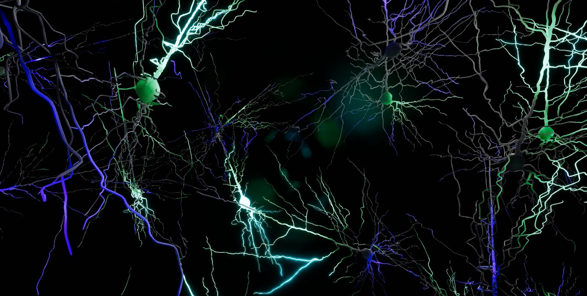
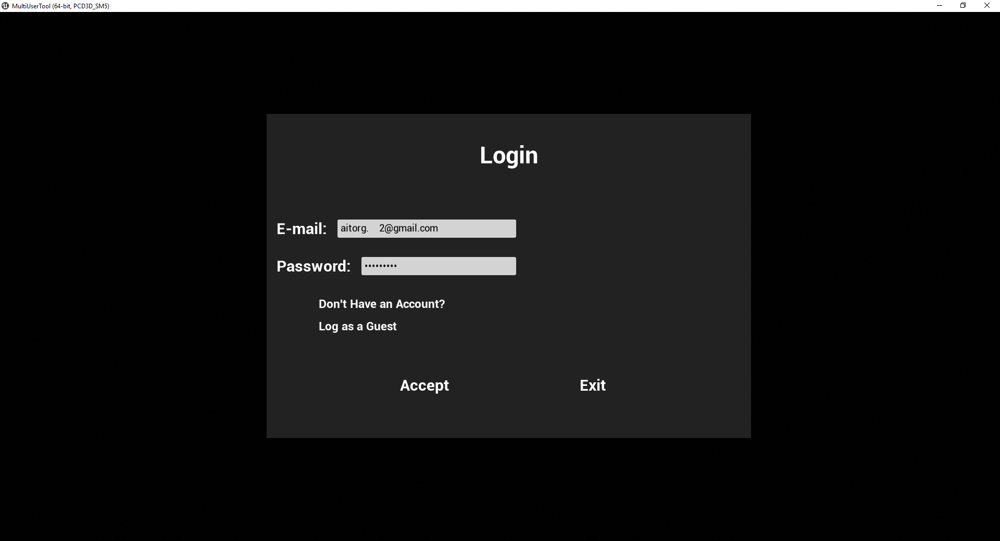
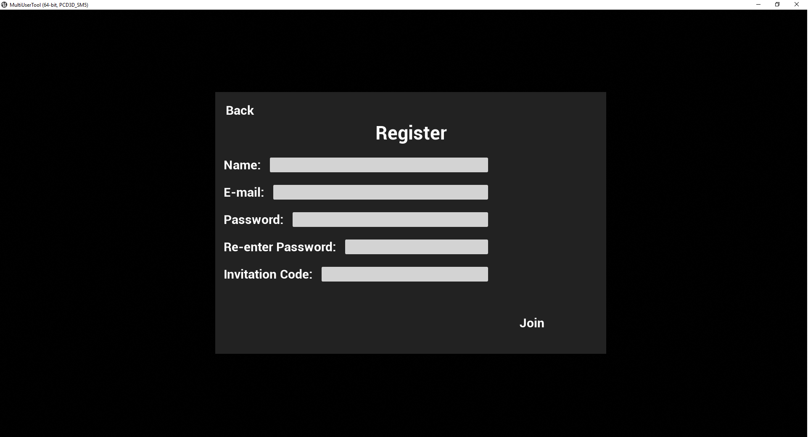
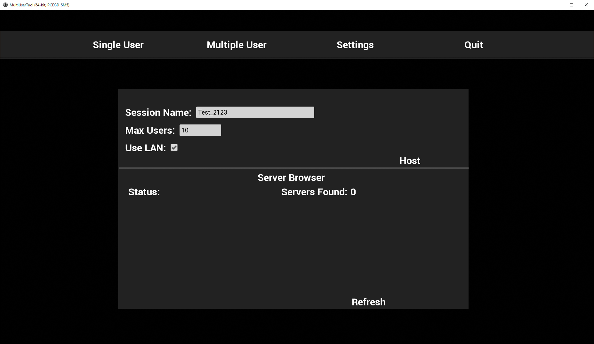
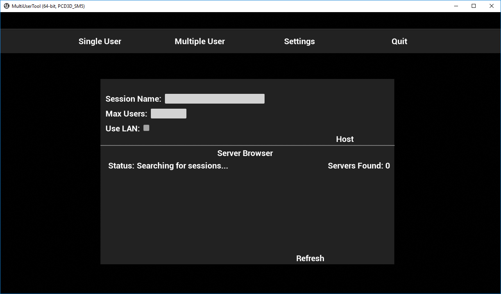
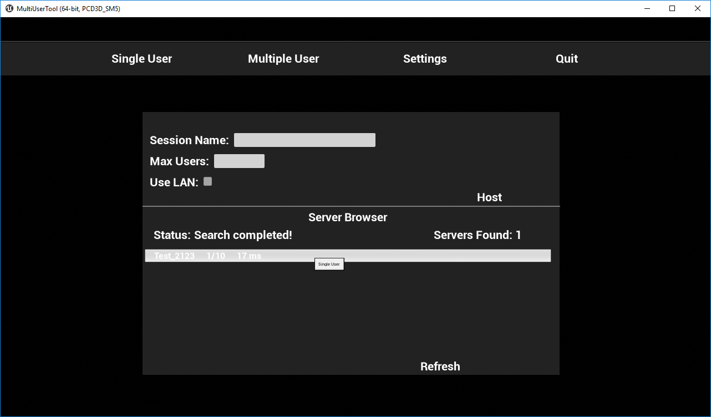
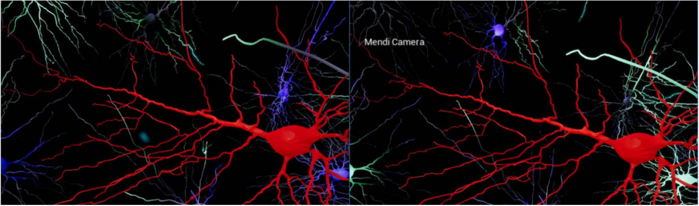
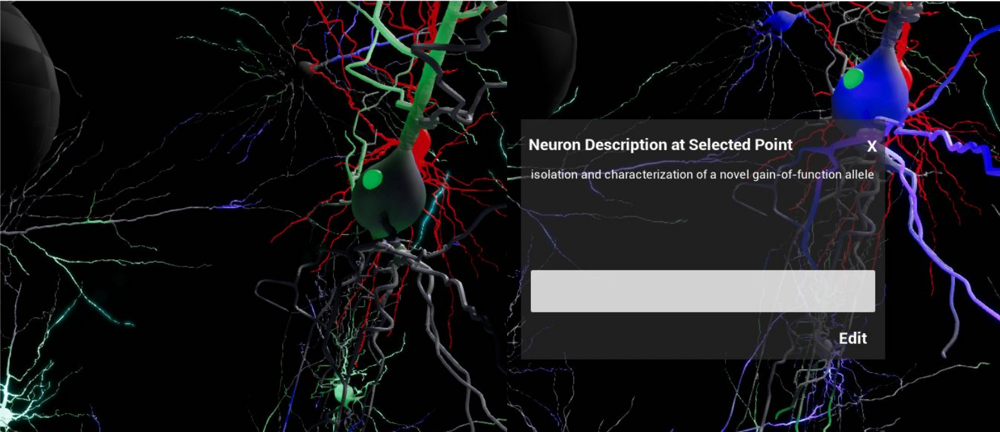
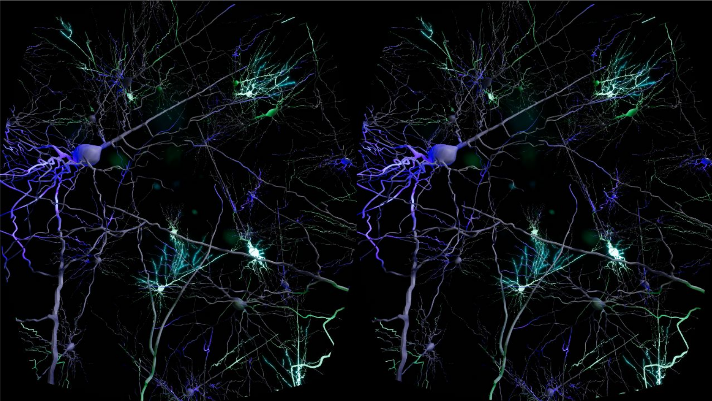

# Collaborative visualization infrastructure on neuroscientific scenes using Unreal Engine 4
This project bring out a study of collaborative scientific visualization techniques and interactive communication methods, as well as the study of the work environment.

Also it has been developed is an infrastructure composed of a scientific visualization tool implemented on the Unreal Engine game engine, a persistence system and a RESTful web service for the management of persistence, which also provides a graphical interface for the extraction of information produced within the analysis tool.

Finally, the result is a system that will provide researchers with the ability to collaborate in neuroscientific scene analysis studies within the Human Brain Project (HBP).

## Dissertation Link
[Dissertation](Docs/Memoria.pdf) (text is in spanish)

## Some images

